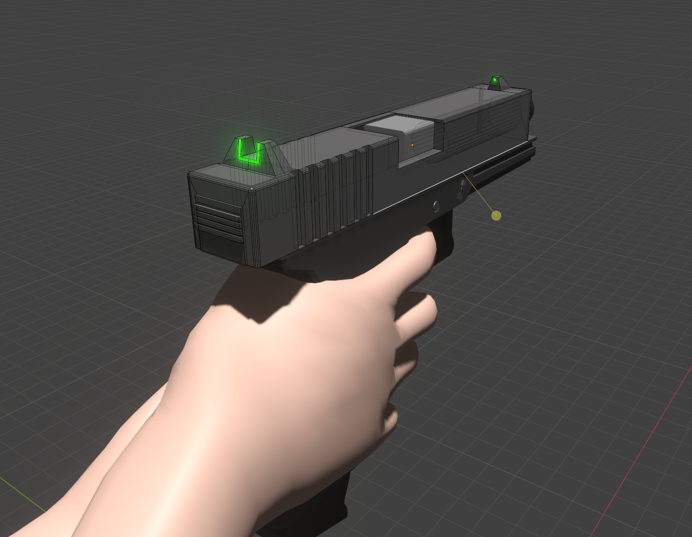
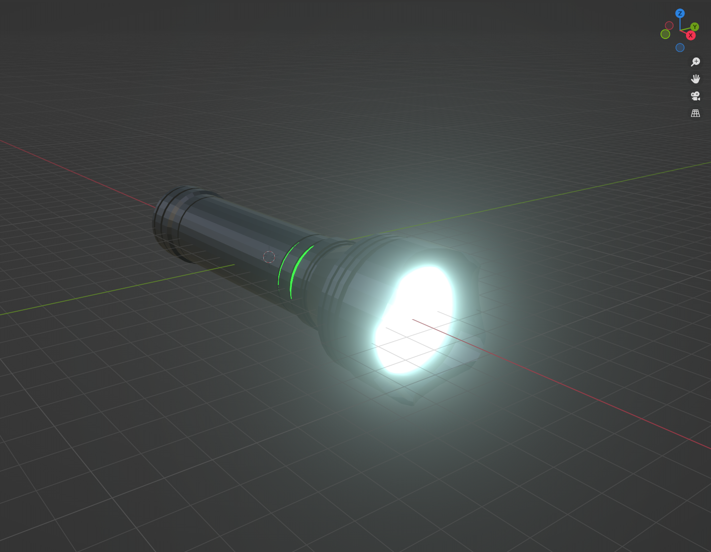

# Forgotten Experiment

  
  
  
  

  
> Main topics: horror, puzzle, action

The game takes place in an abandoned laboratory within the underground of a secret research complex. The main protagonist is a scientist who wakes up without any memory after an accident and tries to remember what happened in the laboratory.

__Current status:__ creating of base assets

  
  

